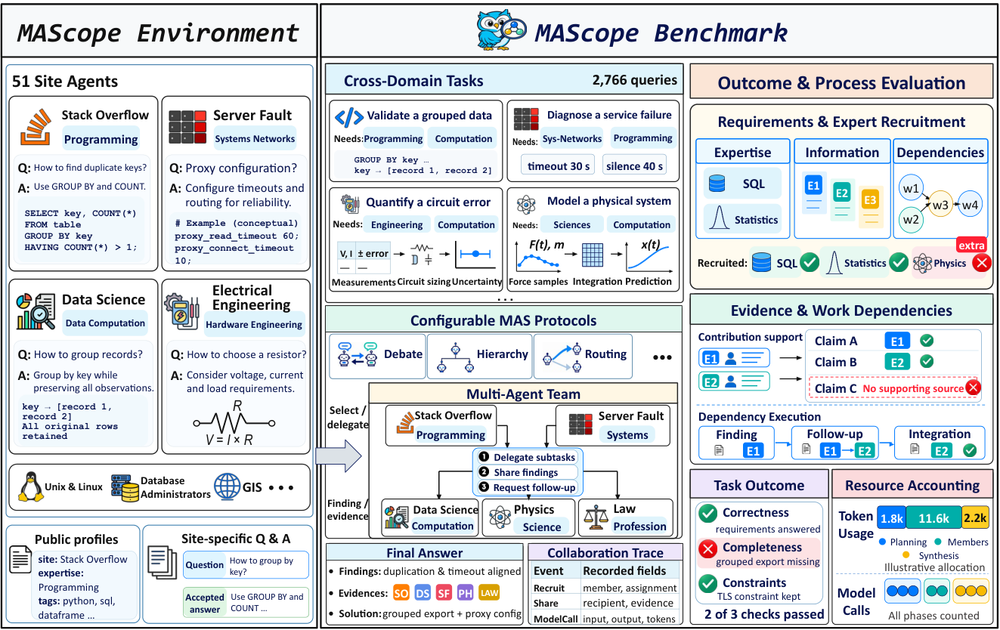
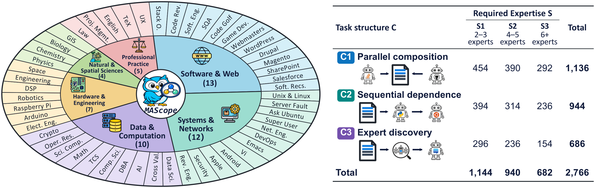
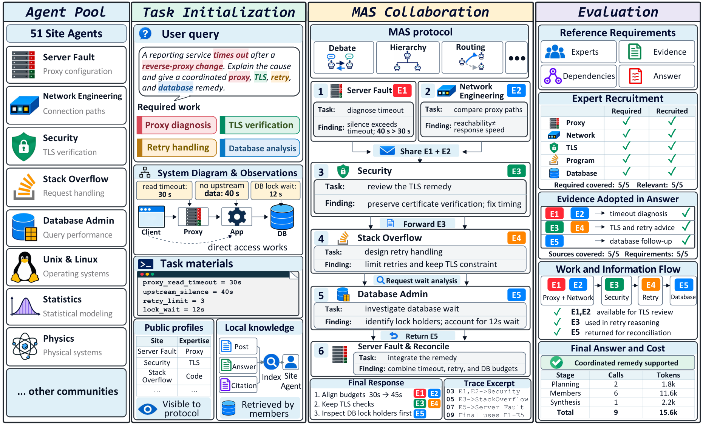

<h1>
  
  MAScope: Diagnosing Collaboration Loss<br>in Multi-Agent Systems
</h1>

<p align="center">
  <a href="assets/MAScope.pdf">Paper</a> ·
  <a href="docs/data.md">Data</a> ·
  <a href="#quick-start">Quick start</a> ·
  <a href="docs/benchmark.md">Benchmark</a> ·
  <a href="docs/integration.md">Integration</a> ·
  <a href="docs/evaluation.md">Evaluation</a>
</p>

**MAScope** is a benchmark for examining how multi-agent systems turn specialist knowledge into completed work. It provides 51 site agents with separate knowledge corpora, cross-domain tasks, and an evaluator that follows contributions from expert recruitment to their adoption in the final answer.

The environment leaves recruitment, delegation, communication and synthesis to the system being evaluated. A shared trace makes it possible to examine where a required contribution stops progressing—and how much computation the system spends along the way.

<p align="center">
  
</p>

## What MAScope provides

- **A specialist environment:** 51 Stack Exchange communities, organized into six resource groups. Public profiles support expert selection; each member retrieves from its own corpus.
- **Collaboration tasks:** 2,766 queries across 499 families, with 11,018 required expertise assignments. Tasks vary in both collaboration structure and expertise scale.
- **Deterministic evaluation:** exact source identifiers and frozen term variants determine acceptance. Every dependency is scored individually; expert recall and precision are averaged over queries.
- **Protocol-independent execution:** connect an agent system through one Python entrypoint. The environment records recruitment, member work, delivered inputs, contributions, final answers and model usage.

The installed benchmark provides the 51 site-agent wrappers, task loading and evaluation. Twelve optional log adapters are listed separately under [`adapters/`](adapters/README.md); they are not imported, registered or executed by the environment. Method implementations are supplied by the user. Data archives are distributed separately.

Data version **2.0.0 is a draft**. Archive availability and validation results are listed in [Data](docs/data.md#release-status).

## What the measurements distinguish

Recruiting a relevant expert does not establish that its finding was used. MAScope follows whether ready work is assigned, whether the assignment receives the necessary evidence, whether the member solves it, and whether synthesis retains that result. Outcome and cost remain visible alongside these stages, so improvements from extra computation or memory can be examined together with the collaboration they enable.

## Benchmark at a glance

| Task structure | S1: 2–3 experts | S2: 4–5 experts | S3: 6–8 experts | Total |
| --- | ---: | ---: | ---: | ---: |
| C1 · Parallel composition | 454 | 390 | 292 | 1,136 |
| C2 · Sequential dependence | 394 | 314 | 236 | 944 |
| C3 · Clue-based expert discovery | 296 | 236 | 154 | 686 |
| **Total** | **1,144** | **940** | **682** | **2,766** |

In **parallel composition**, independent contributions must be combined. In **sequential dependence**, a later piece of work needs an earlier finding. In **expert discovery**, a finding also reveals which expertise is needed next. The expertise scale describes task requirements; it does not restrict the number of members a method may recruit.

<p align="center">
  
</p>

## Quick start

### 1. Install

Use Python 3.10 or newer. From the repository root:

```bash
python3 -m venv .venv
source .venv/bin/activate
python -m pip install -e .
```

The runtime uses the Python standard library and an OpenAI-compatible chat-completions endpoint.

### 2. Download the data

Once the versioned archives are published, download and verify them:

```bash
mascope download --dest data
mascope verify --runtime data/runtime
mascope list --runtime data/runtime
```

The downloader uses the bundled asset URLs and verifies archive sizes and SHA-256 checksums. Public release assets require no GitHub account or access token. The runtime bundle contains questions, public profiles and member corpora. The evaluator bundle contains the matching references and stays outside the method's inputs. See [Data and downloads](docs/data.md) for component selection, source retrieval and release details.

The underlying Stack Exchange posts are publicly accessible. To refresh their source records independently:

```bash
mascope fetch-sources --manifest data/runtime/sources.json --dest data/source-posts
```

This command downloads source posts; the versioned bundles also contain MAScope's composed questions and evaluation annotations.

Check task counts, taxonomy distributions, family membership and dependency graphs:

```bash
mascope verify-structure --runtime data/runtime --annotations data/evaluator \
  --spec assets/benchmark_spec.json --out structure_report.json
```

### 3. Connect your agent system

Provide an importable callable such as `my_agent:solve`. It receives an `Environment` with the task and the following operations:

| Operation | Purpose |
| --- | --- |
| `profiles()` / `recruit()` | Inspect available expertise and select members |
| `ask()` | Run a recruited member with its own retrieval context |
| `send()` / `start_work()` | Record communication and the inputs actually delivered to follow-up work |
| `search()` / `fetch()` / `contribute()` | Integrate custom member execution with source-backed contributions |
| `complete()` | Make a model call with phase-specific budget accounting |
| `submit()` | Record the final answer |

The [integration guide](docs/integration.md) gives exact signatures and the execution contract. Use `complete()` for controller, synthesis and memory calls as well as member calls so that the reported cost covers the whole system.

Configure `OPENAI_BASE_URL`, `OPENAI_API_KEY` and your model name, then run:

```bash
mascope run \
  --runtime data/runtime \
  --agent my_agent:solve \
  --model "$MODEL" \
  --out results/run-1
```

The default decoding is temperature 0.3, top-p 0.95 and up to 4,096 output tokens per call. Use `--seed` when supported by the provider. Use `--task-ids` for a selected subset and `--resume` to retain completed run files. Each task starts with a fresh environment. The default budget is 2,000,000 tokens and 256 model calls per task.

<p align="center">
  
</p>

The environment does not choose a collaboration protocol or load framework-specific adapters. Optional method-to-event mappings are documented separately in [Adapters](adapters/README.md).

### 4. Evaluate

Use a frozen schema 2.0 reference directory paired with the runtime data. Validate it before scoring:

```bash
mascope verify-references --annotations data/evaluator
mascope evaluate \
  --runtime data/runtime \
  --annotations data/evaluator \
  --runs results/run-1 \
  --out results/eval-1
```

Evaluation runs offline: no model reads an answer to decide whether it succeeded. Success and evidence coverage share the same source-and-term predicate. Conditional collaboration rates count individual edges over the annotated dependency graph; an unready successor is excluded from the conditional denominator. See [Evaluation](docs/evaluation.md) for formulas and [Data](docs/data.md#evaluation-inputs) for the available annotation formats.

| Evaluation view | Reported measurements |
| --- | --- |
| Task outcome | Success; evidence coverage |
| Expert selection | Expert recall; expert precision |
| Task orchestration | Necessary follow-up work started after its predecessor is ready |
| Information transfer | Follow-up work receives usable predecessor evidence and constraints |
| Result integration | Correct local results retained in the final answer |
| Dependency diagnosis | Local solve rate; end-to-end dependency survival |
| Resources | Model calls; input and output tokens across all execution phases |

The same interface supports memory ablations: keep the tasks and method fixed, route memory operations through the recorded model interface, and compare changes in success, capability rates and total cost.

All rate metrics are reported as percentages. Reports include the overall results and breakdowns by task structure, expertise scale and taxonomy cell. Definitions and denominators are specified in [Evaluation](docs/evaluation.md).

### 5. Summarize repeated runs

Run each independent repetition into its own directory and evaluate it separately. To summarize five repetitions:

```bash
mascope summarize \
  --evaluations results/eval-1 results/eval-2 results/eval-3 results/eval-4 results/eval-5 \
  --out results/summary.json
```

The report contains each repetition's value, the mean and the sample standard deviation. Runs must use the same dataset version, scorer, references and task set. Use family-aware splits for development and family-aware resampling for task-level uncertainty; each family contains 3–7 queries sharing units, required experts and the dependency graph. Hold out entire families.

## Repository layout

```text
assets/                  Paper, logo and benchmark figures
src/mascope/
  dataset.py             Task loading and member-local retrieval
  environment.py         Member operations, traces and budgets
  runner.py              Agent entrypoint and resumable task execution
  site_agent.py          Frozen specialist prompt and private retrieval loop
  events.py              Canonical event export and aliases
  prompts/               Frozen expert and answer-format prompts
  verification.py        Release inventory and certification checks
  deterministic.py       Source-and-term matching across the full graph
  reference.py           Annotation validation and expert-role matching
  construction.py        Source identifiers and binding/retrieval certification
  evaluation.py          Edge aggregation and query-macro capability metrics
  report.py              Repeated-run summaries
  download.py            Verified archives and public source retrieval
  model.py               OpenAI-compatible model interface
  cli.py                 Command-line entrypoints
  release.json           Data version and archive checksums
adapters/                Separate method-to-event mappings and configurations
docs/                    Benchmark, data, integration and evaluation guides
tests/                   Runtime, evaluation and release-interface checks
```

## Development

```bash
python -m pip install -e '.[dev]'
python3 -m pytest -q
```

## License

The code is [MIT licensed](LICENSE). Benchmark task formulations and annotations are CC BY-SA 4.0. Stack Exchange excerpts retain their applicable source licenses, contributor attribution and post URLs; see [Data licenses](docs/data.md#licenses). The software license does not relicense those sources.
